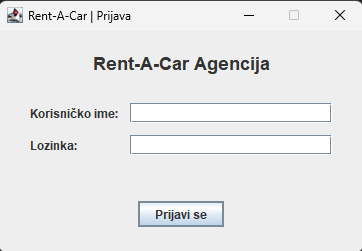
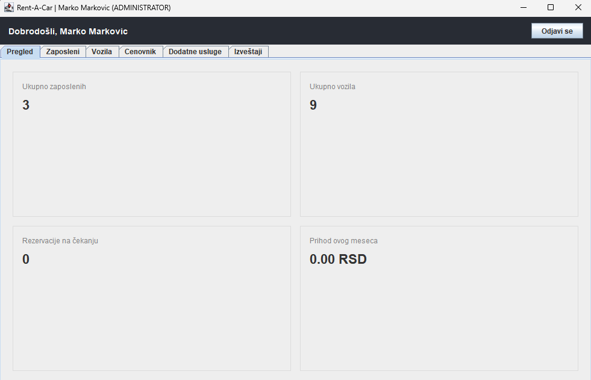
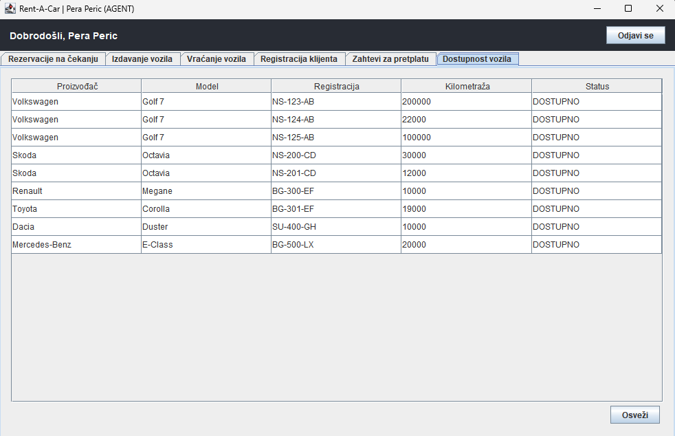
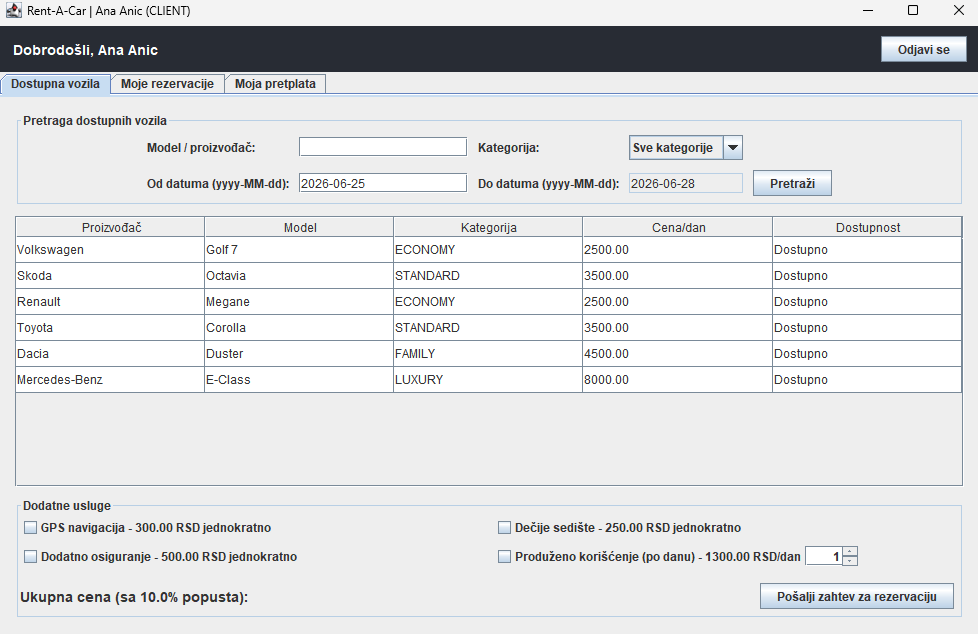

# Rent-a-Car Informacioni Sistem

Informacioni sistem za rad rent-a-car agencije, razvijen kao projektni zadatak iz predmeta **Objektno orijentisano programiranje 1 (2025/2026)**.

Aplikacija pokriva rad sa tri tipa korisnika (Administrator, Agent, Klijent), upravljanje vozilima i rezervacijama, obračun cena po važećem cenovniku, izveštaje i grafičke prikaze.

---

## Sadržaj

- [Tehnologije](#tehnologije)
- [Funkcionalnosti](#funkcionalnosti)
- [Slike](#slike)
- [Pokretanje](#pokretanje)
- [Testovi](#testovi)
- [Čuvanje podataka](#čuvanje-podataka)

---

## Tehnologije

- **Java 17**
- **Swing** - grafički korisnički interfejs
- **XChart** - grafički prikazi (chart-ovi)
- **JUnit 5** - jedinični testovi
- **CSV** - čuvanje podataka u ljudski čitljivom formatu

---

## Funkcionalnosti

### Administrator
- Pun CRUD nad svim entitetima
- Registracija agenata i administratora
- Definisanje cenovnika (pretplata, popusti po kategoriji, cena najma po kategoriji vozila, dodatne usluge, kazne), svaki cenovnik sa datumom početka i kraja važenja
- Podešavanje podrazumevanog trajanja najma (default 3 dana)
- Uvid u prihode i rashode za izabrani period
- Grafički prikazi

### Agent
- Potvrđivanje / odbijanje rezervacija
- Uvid u raspoloživost vozila
- Izdavanje vozila (izbor konkretnog primerka, evidencija kilometraže pri preuzimanju)
- Prijem vraćenih vozila (evidencija kilometraže pri vraćanju, obračun kazni za kašnjenje)
- Registracija novih klijenata i obnova pretplata
- Dodavanje dodatnih usluga prilikom izdavanja

### Klijent
- Pregled dostupnih vozila sa filtriranjem (model, proizvođač, kategorija, opseg datuma)
- Kreiranje zahteva za rezervaciju modela vozila
- Izbor dodatnih usluga (GPS, dečije sedište, dodatno osiguranje, produženo korišćenje)
- Pregled sopstvenih rezervacija sa statusima i potrošenim iznosima
- Otkazivanje rezervacije

### Poslovna pravila
- Cena se obračunava u trenutku kreiranja rezervacije i upisuje u samu rezervaciju
- Klijent ne sme da rezerviše ukoliko poseduje dozvolu kraće od 2 godine
- Bez važeće pretplate nije moguća rezervacija
- Statusi rezervacije: `NA ČEKANJU`, `POTVRĐENA`, `ODBIJENA`, `OTKAZANA`
- Istekle rezervacije (neprihvaćene do datuma početka) se automatski odbijaju
- Ako se klijent ne pojavi, rezervacija postaje `OTKAZANA` i važi zabrana nove rezervacije narednih 24h
- Zahtev za obnovu pretplate se automatski odbija ako je klijent više od 5 puta kasnio sa vraćanjem

### Izveštaji
- Izdavanja po agentu za izabrani opseg datuma
- Rezervacije (potvrđene / odbijene / otkazane) za izabrani opseg datuma
- Modeli vozila - broj iznajmljivanja i rezervacija za izabrani opseg
- Prihodi i rashodi za izabrani period

### Grafički prikazi (XChart)
- Prihodi za prethodnih 12 meseci po kategoriji klijenta + ukupan prihod
- Opterećenje agenata po broju obrađenih rezervacija za prethodnih 30 dana
- Status svih rezervacija kreiranih u prethodnih 30 dana

---

## Slike

> Slike se nalaze u folderu `screenshots/`. Zameni placeholder-e svojim screenshot-ovima.

### Prijava

### Administrator

### Agent

### Klijent

## Pokretanje

**Preduslovi:** Java 17 (JDK), XChart biblioteka na classpath-u.

### Eclipse
1. Importuj projekat: `File > Import > Existing Projects into Workspace`
2. Dodaj XChart JAR na build path (`Project > Properties > Java Build Path > Libraries`) ako nije već dodat
3. Pokreni gui.LoginFrame.java kao Java Application

## Testovi

Implementirani su jedinični testovi za sve menadžer klase (JUnit 5).

U Eclipse-u: desni klik na `test` folder → `Run As > JUnit Test`.

---

## Čuvanje podataka

Svi podaci se čuvaju u CSV formatu (ljudski čitljiv) u `data/` folderu. Za podatke sa predefinisanim skupom vrednosti korišćene su enumeracije.
